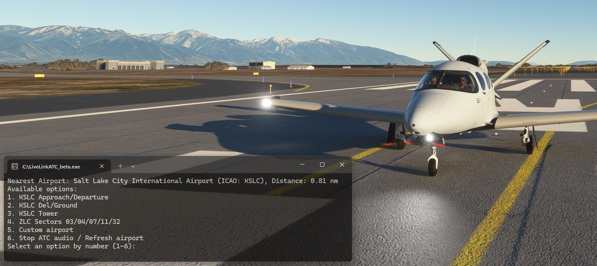

# LiveLinkATC

LiveLinkATC is a companion application for Microsoft Flight Simulator that enhances your flight simulation experience by providing live air traffic control audio from the nearest airport to your in-simulator location. This application is designed to work seamlessly with popular simulation networks and tools such as VATSIM, SayIntentions.ai, and PilotEdge, muting the live ATC audio when these applications transmit audio.

## Features

- **Live ATC Audio**: Stream live ATC audio based on your airplane's location in Microsoft Flight Simulator.
- **Nearest Airports**: Automatically loads the nearest Class B or Class C airports.
- **Custom Airport Selection**: A menu option is available to input any airport identifier, including Class D airports.
- **Seamless Integration**: Automatically mutes live ATC audio when audio is received from SayIntentions.ai, VATSIM, or PilotEdge to avoid overlapping audio.
- **Enhanced Immersion**: Elevate your flight simulation experience with realistic ATC communication.

## Installation

1. **Install VLC Player**: VLC Player is required for audio playback. You can download VLC Player from [here](https://www.videolan.org/vlc/).
2. **Download LiveLinkATC**: Download the `LiveLinkATC_beta.exe` file from the [GitHub releases page](https://github.com/LiveLinkATC/LiveLinkATC/releases).
3. **Run LiveLinkATC**: Execute the `LiveLinkATC_beta.exe` file to start the application.

## Usage

1. **Launch Microsoft Flight Simulator** and start your flight.
2. **Run LiveLinkATC_beta.exe** to start streaming live ATC audio.
Note: If using **SayIntentions.ai, VATSIM, or PilotEdge**, ensure these applications are running first before launching LiveLinkATC. LiveLinkATC will automatically mute live ATC audio when audio is received from these applications.

## Donations

LiveLinkATC is free to use and will always remain free. However, if you enjoy using the application and would like to support the development of new features, donations are appreciated. Your support allows me to continue working on and improving LiveLinkATC. [Donate here](https://www.paypal.com/donate?hosted_button_id=XXXXXXX).

## License

LiveLinkATC is released under the MIT License. See the [LICENSE](LICENSE) file for more details.

## Contact

For any questions, issues, or feature requests, please open an issue on the [GitHub issues page](https://github.com/LiveLinkATC/LiveLinkATC/issues).

---

Thank you for using LiveLinkATC! Enjoy your enhanced flight simulation experience.
